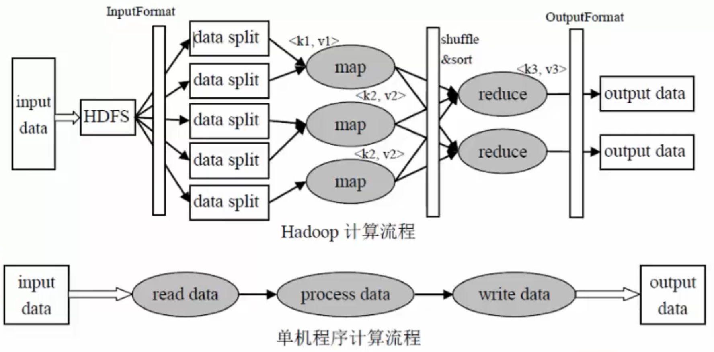
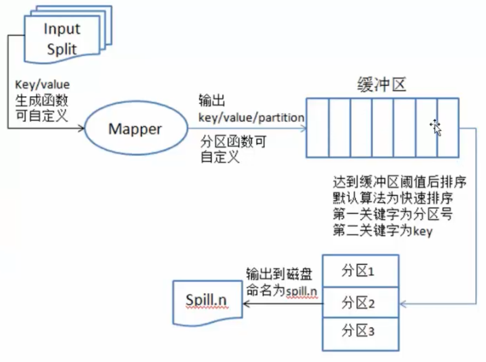
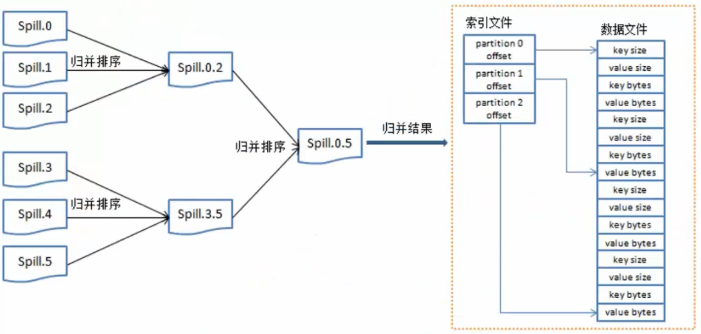
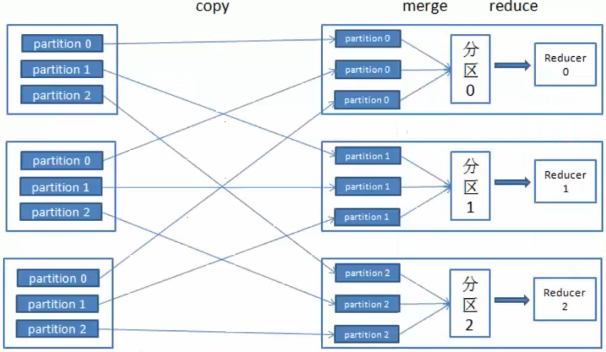
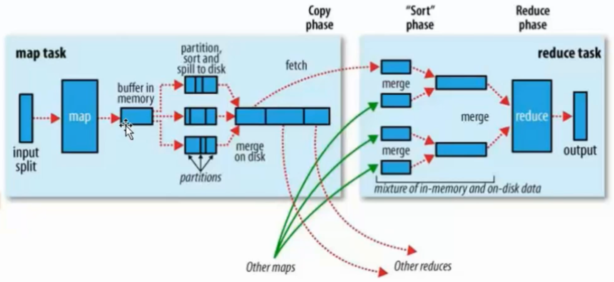
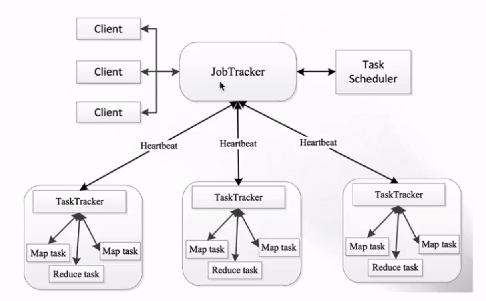
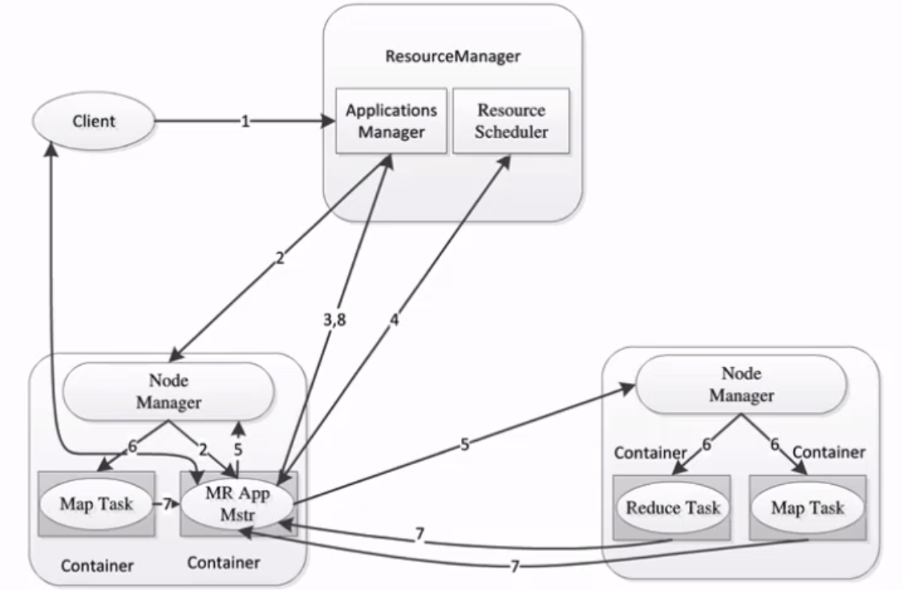

### 3.5.1MapReduce原理详解

**单机程序计算流程**

输入数据--->读取数据--->处理数据--->写入数据--->输出数据

**Hadoop计算流程**

input data：输入数据

InputFormat：对数据进行切分，格式化处理

map：将前面切分的数据做map处理(将数据进行分类，输出(k,v)键值对数据)

shuffle&sort:将相同的数据放在一起，并对数据进行排序处理

reduce：将map输出的数据进行hash计算，对每个map数据进行统计计算

OutputFormat：格式化输出数据

map：将数据进行处理

buffer in memory：达到80%数据时，将数据锁在内存上，将这部分输出到磁盘上

partitions：在磁盘上有很多"小的数据"，将这些数据进行归并排序。

merge on disk：将所有的"小的数据"进行合并。

reduce：不同的reduce任务，会从map中对应的任务中copy数据

​		在reduce中同样要进行merge操作

### 3.5.2 MapReduce架构

- MapReduce架构 1.X
  - JobTracker:负责接收客户作业提交，负责任务到作业节点上运行，检查作业的状态
  - TaskTracker：由JobTracker指派任务，定期向JobTracker汇报状态，在每一个工作节点上永远只会有一个TaskTracker

- MapReduce2.X架构

  - ResourceManager：负责资源的管理，负责提交任务到NodeManager所在的节点运行，检查节点的状态
  - NodeManager：由ResourceManager指派任务，定期向ResourceManager汇报状态

  
